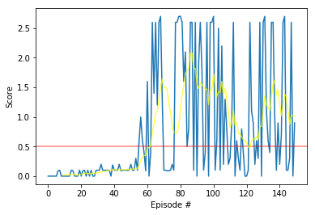

# Project 3: Collaboration and Competition

## The algorithm choice
In order to solve this challenge, I have studied and implemented the **Multi-Agent Deep Deterministic Policy Gradient (MADDPG)** algorithm, as presented in the paper [Multi-Agent Actor-Critic for Mixed Cooperative-Competitive Environments](https://arxiv.org/abs/1706.02275).  

### Learning algorithm

DDPG applies actor-critic model-free policy gradient method for continuous spaces.<br>
As presented in the MADDPG paper, this project adapts the actor-critic method to consider action policies of other agents by adopting a centralized training with decentralized execution.  

**Decentralized execution** means that any agent has its private Actor network and takes actions considering only its observation of the environment.  

**Centralized training** means that, although each agent has its private Critic network, the critic takes as input the observations of any agent present in the environment as well as their actions in order to ease training while learning the action-value function _Q(s,a)_.  
Contrary to this algorithm, independently-learning methods perform poorly since each agent's policy changes during training, resulting in a non-stationary environment (violating Markov assumption) and preventing the naive application of experience replay (that is crucial to stabilize deep Q-learning because it breaks temporal correlation between experiences).  
Another alternative is the use of a single centralized critic for all agents, but it foils the agents to have distinct reward functions (including competitive scenarios).  


### Hyper-parameters

Here is a sum up of all hyperparamters :
```python

    'buffer_size': int(1e6),        # replay buffer size
    'batch_size': 128,              # minibatch size
    'seed': 0,                      # Seed to generate random numbers
    'gamma': 0.99,                      # discount factor
    'tau': 0.15,                        # for soft update of target parameters
    'update_every': 1,                  # update parameters per this number
    'lr_actor': 7e-4,                   # learning rate of the Actor
    'lr_critic': 3e-3,                  # learning rate of the Critic
    'seed': 0,                          # Seed to generate random numbers
    'actor_units': [512, 256],          # Number of nodes in hidden layers of the Actor
    'critic_units': [512, 256],         # Number of nodes in hidden layers of the Critic
    'weight_decay': 0,                  # L2 weight decay
    'noise_theta': 0.15,                # Theta of Ornstein-Uhlenbeck process
    'noise_sigma': 0.01               # Sigma of Ornstein-Uhlenbeck process

```

I tried several learning rates for Actor and Critic among [1e-2, 3e-3, 1e-3, 7e-4, 3e-4, 1e-4].<br>
From those tests, 7e-4(lr of Actor) and 3e-3(lr of Critic) were best.<br>

Also, I tuned number of nodes in layers of Actor and Critic among [(1024, 512), (512, 256), (128, 64)].<br>
(512, 256) was best.<br>

Sigma of Ornstein-Uhlenbeck process was one of critical points.<br>
I already found it on previous Reacher project, and tested sigma with [0.2, 0.1, 0.01, 0.001].<br>
0.01 was best for this environment.<br>

I adjusted tau significantly for fast learning.<br>
The test started from tau = 0.001, but I cannot see any learning progress under 500 tries.<br>
I tested tau with [0.3, 0.2, 0.15, 0.1, 0.01, 0.001],<br>
tau = 0.15 made earliest to reach on 0.5 score after 53 episodes.<br>
With tau = 0.01, it reached on 0.5 score after 254 episodes.


## Network architecture  

### Network input

The observation space consists of 8 variables corresponding to the position and velocity of the ball and racket. Each agent receives its own, local observation.  
In order to keep track of multiple observations into the past, this environment stacks 3 vector observations, allowing their comparison over time.  Thus, each agent receives a vector of observation containing 24 variables, representing the current observation along with the last two.  
The networks in this project receive as input 24 variables, owing to the fact that I opted to work with all three vector observations instead of only the current one.

### Actor and Critic networks

The **Actor Network** receives as input **24** variables representing the observed state-space and generates as output **2** numbers representing the predicted best action for that observation. That means, the Actor is used to approximate the optimal policy _π_ deterministically.

The **Critic Network** receives as input **48** variables representing the observed state-space of both agents (24 variables each). The result of the Critic's first hidden layer and the actions proceeding from any Actor Network are stacked to be passed in as input for the Critic's second hidden layer.  
The output of this network is the prediction of the target value based on the observations and estimated best actions for both agents.
That means, the Critic calculates the optimal action-value function _Q(s, a)_ by using all agents' observations and best-believed actions. That is what defines it as a **centralized critic**.  

### Neural Networks

I tried distinct values for the networks' depth and size, such as [512, 512], [512, 256], [512, 256, 128], [400, 300], [128, 128], [128, 64], [64, 64, 64], [64, 32], [32, 32], [32, 32, 32]. In the end, I concluded that a small network would perform better for this challenge. So, I ended up with two hidden layers, 512 nodes for the first one and 256 for the second one, for both Actor and Critic networks. 

There are two neural networks as the actor and the critic.

* The Actor
1. First layer: (input: state size, 512)
   Activation function: Leaky ReLU
   Batch normalization: (512)
2. Second layer: (512, 256)
   Activation function: Leaky ReLU
   Batch normalization: (256)
3. Output layer: (256, action size)
   Activation function: Tanh

* The Critic
1. First layer: (input: state size, 512)
   Activation function: Leaky ReLU
   Batch normalization: (512)
2. Second layer: (512 + action size, 256)
   Activation function: Leaky ReLU
3. Output layer: (256, 1)
   Activation function: Linear

Leaky ReLU was used instead of ReLU for better performance.<br>
Also, batch normalization made an improvement.

### Learning rate and soft-update

As far as the learning rate goes, the MADDPG paper mentions the use of the value 0.01, combined with the soft-update multiplier tau as 0.01.  
I tested several values for these parameters, along with those minibatch and network sizes mentioned above.  
Many of them were too strong or too weak to make my model converge. So, I tailored them doing tiny changes, one value at each time.  
The setting that reached the best result was learning rates of 0.0007 to the actor and 0.003 for the critic, as well as tau of 0.15 for the soft-update.  


### Plot of Rewards


### Ideas for Future Work
1. One future work might explore deeper the approach of prioritized replay.
2. MADDPG paper introduces a training regimen utilizing an ensemble of policies for each agent that leads to more robust multi-agent polices. This point was not explored in this project and might be pursued in the future.

